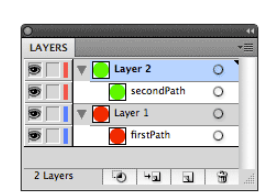
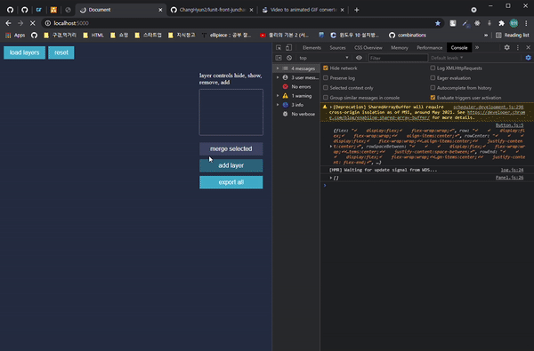
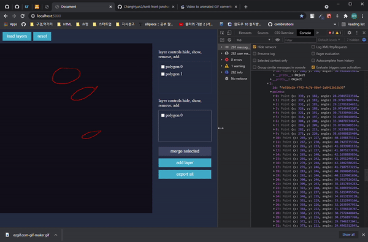

## 컴포넌트

Project
- 그림그리기 프로젝트를 생성하고 이를 관리하는 기능을 고려해 `Project` 컴포넌트를 제작했습니다.
- 프로젝트를 생성 및 관리하는 `ProjectManager`와 생성된 프로젝트로 이동할 수 있는 `ProjectTabs`는 구현하지 못 했습니다.
- `Project`는 자식 컴포넌트로 `ProjectHeader`, `View`, `Panel`를 포함합니다. 

View
- 요구사항의 `Canvas`의 역할을 수행하는 컴포넌트입니다.

Panel
- 요구사항의 `List`의 역할을 수행하는 컴포넌트입니다.
- 자식 컴포넌트로 `LayerCards`와 `PanelControls`를 포함합니다.

LayerCards
- 프로젝트에 그려지는 그림은 레이어로 구성됩니다.
- 각 레이어는 개별적으로 polygon(paths)를 관리하며 레이어가 갖는 상태 정보에 따라서(isVisible, ...) `View`에서 보여집니다.
- 아래와 같은 방식을 적용해보려 했습니다. (paper.js 참고)

PanelControls
- 다각형 병합 기능(merge)과 데이터 추출 기능(export all)을 포함하는 컨트롤러입니다.

## 그림 그리기 구현 내용

- 마우스 이벤트를 이용해 canvas element에 선을 그렸습니다. 그리기 동작은 `View` 컴포넌트에서 수행합니다.
- `View`에서 그림을 그릴 떄, 그림을 이루는 다각형의 좌표 정보는 `canvas context`의 `active layer`에 저장됩니다. `active layer`는 현재 사용 중인 레이어를 의미합니다. 
- `Panel`은 `canvas context`에 저장된 각 레이어의 다각형 정보를 통해 현재 그림에 어떤 다각형이 그려졌는지를 보여줍니다.
- 다각형의 이름을 바꾸는 기능은 추가하지 못 했습니다.
- 선의 색상, 굵기는 Panel에서 이를 설정할 수 있는 `tools`를 만들어주면 좋겠다 생각했지만 추가하지 못 했고 빨간색을 이용해 그림을 그렸습니다.

## 미흡했던 부분
- merge 기능을 완성하지 못 했습니다.

## 미리 보기

## 참고 내용

### css

### Canvas API

- Paper.js
- https://www.youtube.com/watch?v=FLESHMJ-bI0
- http://bucephalus.org/text/CanvasHandbook/CanvasHandbook.html
