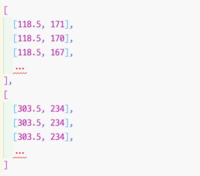

# 루닛 과제 전형

## 과제 목표

단순다각형(simple polygon) 그리기와 병합 기능(선택사항)을 가지는 웹 애플리케이션을 구현합니다. 본
과제에서는 기능의 작동 여부 뿐 아니라 코드 구조, 가독성 등의 다양한 항목을 평가하므로, 기능이 일부
미완성이더라도 기한 내에 제출하여 주시기 바랍니다.

## 요구 사항

### 필수

1. `<Canvas />`와 `<List />`의 두 컴포넌트로 나뉘는 웹 애플리케이션을 작성합니다. React를
사용하셔도 되고, React 외에 더 익숙하신 프레임워크를 사용하셔도 무방합니다.

2. Canvas 위에서 마우스 주 버튼(왼쪽)을 클릭 후 드래그하면 마우스 커서를 따라 선이
그려집니다. 마우스 버튼을 떼면 선의 시작점과 끝점이 직선으로 연결되어 다각형이 완성됩니다.
완성된 다각형에 해당하는 아이템이 List에 표시됩니다. 선의 색상 및 굵기 등의 세부사항에
제약은 없습니다.

3. Export All 버튼을 누르면 화면상에 그려진 다각형에 해당하는 객체 모두를 JSON으로 변환하여
console.log()로 출력합니다. 개별 다각형의 자료구조는 어떠한 형태여도 무방하나, 출력된
JSON은 반드시 각각의 다각형을 요소로 가지는 하나의 배열이어야 합니다.

### 선택

1. 서로 교차하는 두 다각형을 List에서 선택 후 Merge Selected 버튼을 누르면 선택한 다각형들을
지우고, 예시와 같이 두 다각형을 병합한 새 다각형을 그립니다. 본 과제에서는 서로 교차하는 두
다각형이 모두 단순다각형인 경우에만 정상적으로 병합이 이루어지면 됩니다.

2. Export All 버튼을 누르면 화면상에 그려진 다각형에 해당하는 객체 모두를 JSON으로 변환하여
console.log()로 출력합니다. 1에서 병합한 다각형은 출력된 JSON 배열에서도 하나의
요소로 표현되어야 합니다.

## 참고 내용

### css

### Canvas API

- Paper.js
- https://www.youtube.com/watch?v=FLESHMJ-bI0
- http://bucephalus.org/text/CanvasHandbook/CanvasHandbook.html

## 구조

- project
  - setLayers => view, layerLis

    - layer
      - add => view, layerList
      - remove => view, layerList,
      - hide  => view, layerList,
      - show  => view, layerList,

          - polygon 
            - add => layerList
            - remove => view, layerList
            - options => view, layerList

    checkMerge => merge => view, layerList
